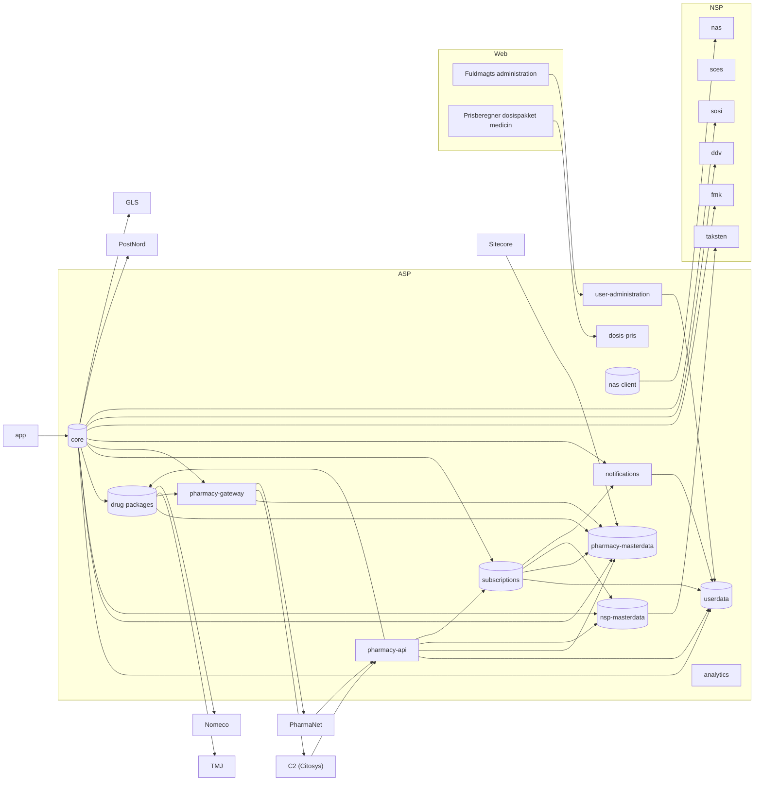

# Apoteksapp Public Documentation

This repository contains the public documentation for **Apotekernes Service Platform (ASP)**.

## ASP Pharmacy API

More information can be found in the [/asp-pharmacy-api](./asp-pharmacy-api) subfolder.

## Pharmacy System API

More information can be found in the [/pharmacy-system-api](./pharmacy-system-api) subfolder.

## Dependency graph

The following figure illustrates the dependencies of the ASP.
An arrow from `A` -> `B` means that `A` depends on `B`, or alternatively: `A` initiates sends requests to `B`.
A cylinder shape indicates an ASP component with a database.

*Note that Kafka is also used as a means of data transfer, but is not shown in the dependency graph, as its bi-directional arrows only serve to muddle the picture*

